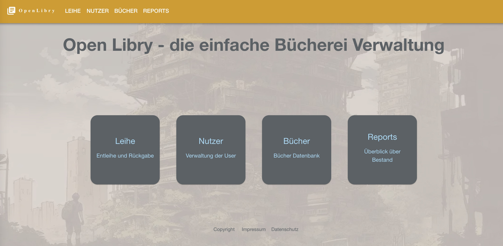
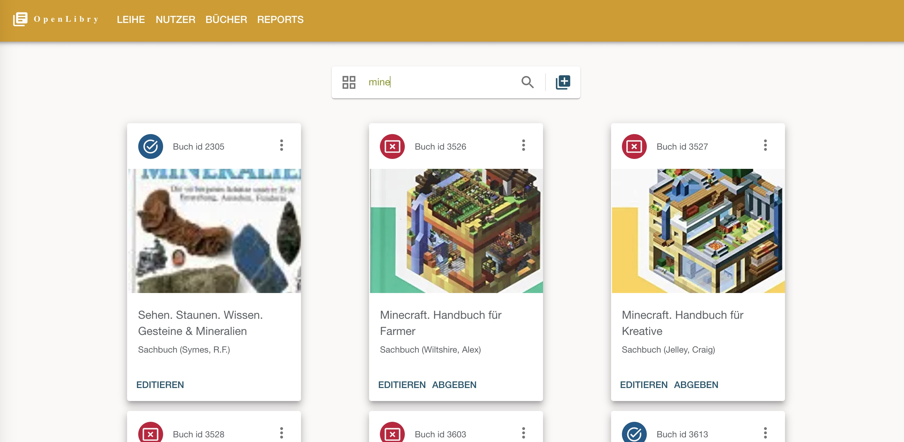

# OpenLibry - Die einfache und freie Software für die Schulbibliothek

OpenLibry ist eine einfache, schnelle und offene Verwaltung für kleine Bibliotheken, z.B. in Schulen. Sie wurde optimiert auf einfache Bedienung in einer trubeligen Umgebung, in der kleine Kinder Bücher abgeben, ausleihen, weitergeben und liegen lassen.

## Idee
Die Idee entstand in unserer Grundschule, in der OpenBiblio im Einsatz war, eine quelloffene und kostenlose Software, die aber schon seit vielen Jahren nicht mehr gepflegt wird. Viele Eltern und Freiwillige engagieren sich ehrenamtlich, um die Bücher zu katalogisieren, Nutzer-Ausweise zu drucken und die Ausleihzeiten zur Verfügung zu stehen - trotzdem habe ich keine kostenlose digitale Lösung gefunden um sie zu unterstützen. So entstand **OpenLibry**.

## Features

- Nutzbar auf Computer, Tablet und Handy
- On-the-fly-Suche während man tippt nach Büchern, Leihen und NutzerInnen
- Optimiert auf wenige Maus- und Tastaturklicks, insbesondere für die Ausleihe und Rückgabe
- Cover-Bilder für Bücher können eingefügt werden
- Einfache Installation in einer lokalen Umgebung oder in einer Cloud
- Kein komplizierter Schnickschnack mit Nutzerberechtigungen, drölfzig unnötigen Datenfeldern usw.
- Moderner Software-Stack mit next.js Oberfläche und einfacher Datenbank
- Importfunktion für Daten von alten OpenBiblio-Installationen

## Screenshots

Start-Screen

Ausleih-Screen

Bücherverwaltung-Screen

Edit-Screen

## Installation und Konfiguration

- Kopiere das Beispiel Environment file: `cp .env_example .env`
- Konfiguriere den Server Namen in einer `.env` Datei im Hauptordner, z.B. `NEXT_PUBLIC_API_URL="http://localhost:3000"
`

### Bare metal am Beispiel Raspberry Pi

### Docker

- Baue das image mit `docker build --no-cache -t openlibry .`
- Führe das image in docker aus `docker run -p:3010:3010 openlibry`
- Öffne OpenLibry im Browser: `http://localhost:3010`

**Achtung**, das ist ein Sandbox Setup, um schnell damit spielen zu können. Für Production-Use sollte Docker noch automatisiert gestartet werden und die Datenbank auf einem persistenten Volume gehostet werden.

## REST API

Die REST API kennt die Resourcen `book` und `user`. Für beide gibt es jeweils die entsprechenden http Operationen (GET, PUT, POST, DELETE). Die Ausleihe entsteht durch die Verknüpfung von `user` und `book`, also z.B. `http://localhost:3000/api/book/2001/user/1080` um ein Buch auszuleihen.

Weitere Beispiele sind im [docs](./doc/sampleAPIRequests/) Folder aufgeführt.

## Import aus OpenBiblio

Siehe [Open Biblio](https://openbiblio.de/), die [Import-Schritte](./doc/OpenBiblioImport.md)

Falls Cover importiert werden:
ISBN Service für 10 und 13 ISBN: 
https://openlibrary.org/isbn/9780140328721
Cover: 
https://covers.openlibrary.org/13834659

## Kontakt

Falls ihr mitmachen wollt, die Software nutzen wollt oder ein Hosting sucht, schreibt mich gern unter [info@openlibry.de](info@openlibry.de) an.
