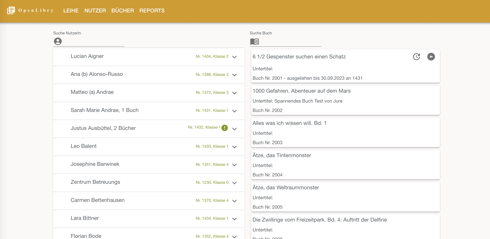
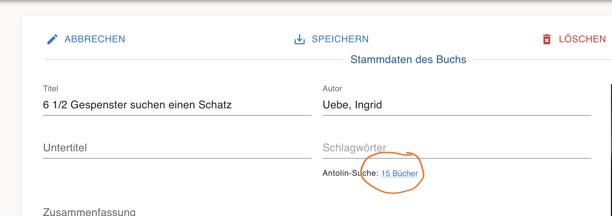

# OpenLibry - Die einfache und freie Software für die Schulbibliothek

OpenLibry ist eine einfache, schnelle und offene Verwaltung für kleine Bibliotheken, z.B. in Schulen. Sie wurde optimiert auf einfache Bedienung in einer trubeligen Umgebung, in der kleine Kinder Bücher abgeben, ausleihen, weitergeben und liegen lassen.

## Idee
Die Idee entstand in unserer Grundschule, in der OpenBiblio im Einsatz war, eine quelloffene und kostenlose Software, die aber schon seit vielen Jahren nicht mehr gepflegt wird. Viele Eltern und Freiwillige engagieren sich ehrenamtlich, um die Bücher zu katalogisieren, Nutzer-Ausweise zu drucken und zu Ausleihzeiten zur Verfügung zu stehen - trotzdem habe ich keine kostenlose digitale Lösung gefunden, um sie zu unterstützen. So entstand **OpenLibry**.

## Features

- Nutzbar auf Computer, Tablet und Handy
- On-the-fly-Suche während man tippt nach Büchern, Leihen und NutzerInnen. Einfacher Filter für überfällige Bücher in einer Klasse direkt im Ausleih-Screen
- Optimiert auf wenige Maus- und Tastaturklicks, insbesondere für die Ausleihe und Rückgabe
- Cover-Bilder für Bücher können eingefügt werden
- Einfache Installation in einer lokalen Umgebung oder in einer Cloud
- Kein komplizierter Schnickschnack mit Nutzerberechtigungen, drölfzig unnötigen Datenfeldern usw.
- Moderner Software-Stack mit next.js-Oberfläche und einfacher Datenbank
- Importfunktion für Daten von alten OpenBiblio-Installationen

## Screenshots

Start-Screen

Ausleih-Screen

Bücherverwaltung-Screen

Edit-Screen

## Installation und Konfiguration

- Kopiere das Beispiel-Environment-File: `cp .env_example .env`
- Konfiguriere den Servernamen in einer `.env`-Datei im Hauptordner entsprechend der Werte im `.env_example`, z.B. `NEXT_PUBLIC_API_URL="http://localhost:3000"
`
- Der Wert `AUTH_ENABLED` sollte zunächst auf `false` gesetzt werden, so dass man sich beim ersten Login ohne Authentifizierung einloggen kann. Via `https://<domain>/auth/register` kann man dann den ersten User anlegen und danach `AUTH_ENABLED` auf `true` setzen.

### Bare Metal am Beispiel Raspberry Pi

Für eine lokale Installation ohne Docker befolge diese Schritte:

- Update der Distribution: `sudo apt-get update` und `sudo apt-get upgrade`
- Falls `curl` nicht installiert ist: `apt install curl`
- Installiere den node version manager NVM: `curl -o- https://raw.githubusercontent.com/nvm-sh/nvm/v0.39.1/install.sh | bash`. Damit sollte `nvm` installiert sein.
 - Installiere den node server: `nvm install --lts`
 - Falls noch kein `git` installiert ist: `sudo apt-get install git-all` 
 - Kopiere das Repository aus github: `git clone https://github.com/jzakotnik/openlibry.git`
 - Nutze das entsprechende Verzeichnis: `cd openlibry`
 - Kopiere das Beispielfile und passe den API-Endpunkt mit dem entsprechenden Servernamen an: `cp .env_example .env` und ggf. `nano .env`
- Installiere alle notwendigen node-Pakete: `npm install`
- Erzeuge eine leere Datenbank (SQLite): `npx prisma db push`
- Starte OpenLibry mit `npm run dev`. Achte darauf, dass der entsprechende Port freigegeben ist und über den Browser zugänglich ist.

### Docker

- Baue das Image mit `docker build --no-cache -t openlibry .`
- Führe das Image in Docker aus `docker compose up`
- Das SQLite-File wird auf einem Volume gemappt. Beim ersten Ausführen logge Dich in den Container ein `docker exec -it openlibry /bin/sh` und führe `npx prisma db push` aus, um das DB-File zu erzeugen.
- Öffne OpenLibry im Browser: `http://localhost:3000`

**Achtung**, das ist ein Sandbox-Setup, um schnell damit spielen zu können. Für Production-Use sollte Docker noch automatisiert gestartet werden.

### Installation mit nginx als reverse proxy und pm2 als Package Manager

Eine Installationsanleitung für die Konfiguration mit dem Webserver nginx auf einer Subdomain findet sich [hier](./doc/WebServerInstall.md)

### Initialisierung mit einem ersten User
- Setze die Auth Variable in `.env` auf `false` um sich ohne Authentifizierung anzumelden
- Via `/auth/register` erzeuge einen neuen User
- Setze die Auth Variable auf `true`

## REST-API

Die REST-API kennt die Resourcen `book` und `user`. Für beide gibt es jeweils die entsprechenden http-Operationen (GET, PUT, POST, DELETE). Die Ausleihe entsteht durch die Verknüpfung von `user` und `book`, also z.B. `http://localhost:3000/api/book/2001/user/1080`, um ein Buch auszuleihen.

Die API kann verwendet werden, um User/Bücher aus anderen Programmen automatisiert zu importieren.

Weitere Beispiele sind im [docs](./doc/sampleAPIRequests/)-Folder aufgeführt.

## Suche in Antolin Datensatz

Um Bücher einfacher mit dem Schlagwort der Antolin Leseförderung versehen zu können, kann der Antolin Export des Westermann Verlags eingebunden werden. Dazu kann man Westermann/Antolin kontaktieren und bekommt dort einen Link auf eine csv Datei mit dem Export alles Antolin Bücher. Dieser ist im Ordner `/public/antolin/antolingesamt.csv` abzulegen.
Im Edit-Screen der Bücher kann man dann sehen ob ähnliche Bücher in der Antolin Datenbank vorhanden sind.
. OpenLibry durchsucht dabei die Datenbank nach Datensätzen bei denen der Autor und Titel vorkommmen, insbesondere wenn es keinen direkten Link via ISBN gibt. 

## Import aus OpenBiblio und anderen Tools

Siehe [Open Biblio](https://openbiblio.de/), die [Import-Schritte](./doc/OpenBiblioImport.md)

Das Datenmodell für Bücher beinhaltet aktuell folgende Felder (alle optional bis auf Titel und Autor). Die anderen Felder sind im [Schema](./prisma/schema.prisma) einsehbar:
| Feld-Name  | Funktion  |
|---|---|
|id| Mediennummer|        
|rentalStatus |Ausleihstatus (available, rented, lost)|
|rentedDate  |Ausleihdatum|
|dueDate      |Rückgabedatum|
|renewalCount |Anzahl Verlängerungen|
|title        |Titel|
|subtitle   |Untertitel|
|author    |Autor(en)|
|topics    |Schlagwörter mit Semikolon getrennt|
|imageLink  |Cover Bild|
|isbn         |ISBN Nummer|           
|editionDescription|Edition / Band|
|publisherLocation|Verlagsort|
|pages              |Anzahl Seiten|    
|summary             |Zusammenfassung|
|minPlayers          |Anzahl Spieler (bei Brettspielen)|
|publisherName   |Verlag|
|otherPhysicalAttributes|Andere physische Eigenschaften (bei Brettspielen)| 
|supplierComment       |Quelle, z.B. Spende|
|publisherDate           |Publikationsdatum|
|physicalSize            |Abmessungen|
|minAge                  |Mindestalter|
|maxAge                  |Höchstalter|
|additionalMaterial    |Zusätzliches Material, z.B. CD oder DVD|
|price                   |Preis|
|externalLinks   |Externe Verknüpfungen|

Falls Cover importiert werden:
ISBN-Service für ISBN-10 und ISBN-13: 
https://openlibrary.org/isbn/9780140328721
Cover: 
https://covers.openlibrary.org/13834659

## Kontakt

Falls Ihr mitmachen wollt, die Software nutzen wollt oder ein Hosting sucht, schreibt mich gerne unter [info@openlibry.de](info@openlibry.de) an. Falls Ihr die Software finanziell unterstützen wollt, geht es bei [Ko-Fi](https://ko-fi.com/jzakotnik) sehr einfach.
