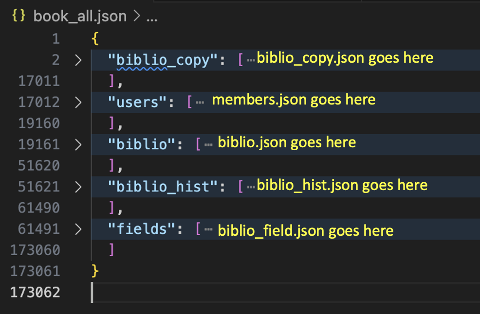

# Import aus OpenBiblio

Siehe [Open Biblio](https://openbiblio.de/)

If you use an old version of the open source software `OpenBiblio`, there's a possibility to migrate the data over. It's a bit of manual effort, in particular because it uses a very old mySQL version. Follow these steps to run a dockerized mySQL and export the data from the admin interface.

- Start podman with docker compose (see OpenBiblio folder)
```bash
podman machine stop
podman machine rm                                                          
podman machine init --cpus 4 --memory 16384
podman machine start
```

- Create `docker.compose.yaml` with this content:
```yml
version: '3.1'
services:
  db:
   
    container_name: mysql-server-db
    image: biarms/mysql:5.7
    restart: always
    environment:
      MYSQL_ROOT_PASSWORD: root
      MYSQL_DATABASE: test_db
    ports:
      - "3308:3306"
  phpmyadmin:
    image: phpmyadmin/phpmyadmin:latest
    restart: always
    environment:
      PMA_HOST: db
      PMA_USER: root
      PMA_PASSWORD: root
    ports:
      - "8080:80"
```

- Start compose
`podman-compose -f docker-compose.yaml up`
- Create a database with name `openbiblio` in phpmyadmin running on `http://localhost:8080/`

- Copy the files over the running container, replace the respective path with the OpenBiblio backup.
```bash
podman cp ./input-03-11-2023/biblio.MYD mysql-server-db:/var/lib/mysql/openbiblio
podman cp ./input-03-11-2023/biblio.MYI mysql-server-db:/var/lib/mysql/openbiblio
podman cp ./input-03-11-2023/biblio.frm mysql-server-db:/var/lib/mysql/openbiblio
podman cp ./input-03-11-2023/biblio_copy.MYD mysql-server-db:/var/lib/mysql/openbiblio
podman cp ./input-03-11-2023/biblio_copy.MYI mysql-server-db:/var/lib/mysql/openbiblio
podman cp ./input-03-11-2023/biblio_copy.frm mysql-server-db:/var/lib/mysql/openbiblio
podman cp ./input-03-11-2023/biblio_field.MYD mysql-server-db:/var/lib/mysql/openbiblio
podman cp ./input-03-11-2023/biblio_field.MYI mysql-server-db:/var/lib/mysql/openbiblio
podman cp ./input-03-11-2023/biblio_field.frm mysql-server-db:/var/lib/mysql/openbiblio
podman cp ./input-03-11-2023/biblio_hold.MYD mysql-server-db:/var/lib/mysql/openbiblio
podman cp ./input-03-11-2023/biblio_hold.MYI mysql-server-db:/var/lib/mysql/openbiblio
podman cp ./input-03-11-2023/biblio_hold.frm mysql-server-db:/var/lib/mysql/openbiblio
podman cp ./input-03-11-2023/biblio_status_dm.MYD mysql-server-db:/var/lib/mysql/openbiblio
podman cp ./input-03-11-2023/biblio_status_dm.MYI mysql-server-db:/var/lib/mysql/openbiblio
podman cp ./input-03-11-2023/biblio_status_dm.frm mysql-server-db:/var/lib/mysql/openbiblio
podman cp ./input-03-11-2023/biblio_status_hist.MYD mysql-server-db:/var/lib/mysql/openbiblio
podman cp ./input-03-11-2023/biblio_status_hist.MYI mysql-server-db:/var/lib/mysql/openbiblio
podman cp ./input-03-11-2023/biblio_status_hist.frm mysql-server-db:/var/lib/mysql/openbiblio
podman cp ./input-03-11-2023/collection_dm.MYD mysql-server-db:/var/lib/mysql/openbiblio
podman cp ./input-03-11-2023/collection_dm.MYI mysql-server-db:/var/lib/mysql/openbiblio
podman cp ./input-03-11-2023/collection_dm.frm mysql-server-db:/var/lib/mysql/openbiblio
podman cp ./input-03-11-2023/db.opt mysql-server-db:/var/lib/mysql/openbiblio
podman cp ./input-03-11-2023/material_type_dm.MYD mysql-server-db:/var/lib/mysql/openbiblio
podman cp ./input-03-11-2023/material_type_dm.MYI mysql-server-db:/var/lib/mysql/openbiblio
podman cp ./input-03-11-2023/material_type_dm.frm mysql-server-db:/var/lib/mysql/openbiblio
podman cp ./input-03-11-2023/mbr_classify_dm.MYD mysql-server-db:/var/lib/mysql/openbiblio
podman cp ./input-03-11-2023/mbr_classify_dm.MYI mysql-server-db:/var/lib/mysql/openbiblio
podman cp ./input-03-11-2023/mbr_classify_dm.frm mysql-server-db:/var/lib/mysql/openbiblio
podman cp ./input-03-11-2023/member.MYD mysql-server-db:/var/lib/mysql/openbiblio
podman cp ./input-03-11-2023/member.MYI mysql-server-db:/var/lib/mysql/openbiblio
podman cp ./input-03-11-2023/member.frm mysql-server-db:/var/lib/mysql/openbiblio
podman cp ./input-03-11-2023/member_account.MYD mysql-server-db:/var/lib/mysql/openbiblio
podman cp ./input-03-11-2023/member_account.MYI mysql-server-db:/var/lib/mysql/openbiblio
podman cp ./input-03-11-2023/member_account.frm mysql-server-db:/var/lib/mysql/openbiblio
podman cp ./input-03-11-2023/session.MYD mysql-server-db:/var/lib/mysql/openbiblio
podman cp ./input-03-11-2023/session.MYI mysql-server-db:/var/lib/mysql/openbiblio
podman cp ./input-03-11-2023/session.frm mysql-server-db:/var/lib/mysql/openbiblio
podman cp ./input-03-11-2023/settings.MYD mysql-server-db:/var/lib/mysql/openbiblio
podman cp ./input-03-11-2023/settings.MYI mysql-server-db:/var/lib/mysql/openbiblio
podman cp ./input-03-11-2023/settings.frm mysql-server-db:/var/lib/mysql/openbiblio
podman cp ./input-03-11-2023/staff.MYD mysql-server-db:/var/lib/mysql/openbiblio
podman cp ./input-03-11-2023/staff.MYI mysql-server-db:/var/lib/mysql/openbiblio
podman cp ./input-03-11-2023/staff.frm mysql-server-db:/var/lib/mysql/openbiblio
podman cp ./input-03-11-2023/state_dm.MYD mysql-server-db:/var/lib/mysql/openbiblio
podman cp ./input-03-11-2023/state_dm.MYI mysql-server-db:/var/lib/mysql/openbiblio
podman cp ./input-03-11-2023/state_dm.frm mysql-server-db:/var/lib/mysql/openbiblio
podman cp ./input-03-11-2023/theme.MYD mysql-server-db:/var/lib/mysql/openbiblio
podman cp ./input-03-11-2023/theme.MYI mysql-server-db:/var/lib/mysql/openbiblio
podman cp ./input-03-11-2023/theme.frm mysql-server-db:/var/lib/mysql/openbiblio
podman cp ./input-03-11-2023/transaction_type_dm.MYD mysql-server-db:/var/lib/mysql/openbiblio
podman cp ./input-03-11-2023/transaction_type_dm.MYI mysql-server-db:/var/lib/mysql/openbiblio
podman cp ./input-03-11-2023/transaction_type_dm.frm mysql-server-db:/var/lib/mysql/openbiblio
podman cp ./input-03-11-2023/usmarc_block_dm.MYD mysql-server-db:/var/lib/mysql/openbiblio
podman cp ./input-03-11-2023/usmarc_block_dm.MYI mysql-server-db:/var/lib/mysql/openbiblio
podman cp ./input-03-11-2023/usmarc_block_dm.frm mysql-server-db:/var/lib/mysql/openbiblio
podman cp ./input-03-11-2023/usmarc_indicator_dm.MYD mysql-server-db:/var/lib/mysql/openbiblio
podman cp ./input-03-11-2023/usmarc_indicator_dm.MYI mysql-server-db:/var/lib/mysql/openbiblio
podman cp ./input-03-11-2023/usmarc_indicator_dm.frm mysql-server-db:/var/lib/mysql/openbiblio
podman cp ./input-03-11-2023/usmarc_subfield_dm.MYD mysql-server-db:/var/lib/mysql/openbiblio
podman cp ./input-03-11-2023/usmarc_subfield_dm.MYI mysql-server-db:/var/lib/mysql/openbiblio
podman cp ./input-03-11-2023/usmarc_subfield_dm.frm mysql-server-db:/var/lib/mysql/openbiblio
podman cp ./input-03-11-2023/usmarc_tag_dm.MYD mysql-server-db:/var/lib/mysql/openbiblio
podman cp ./input-03-11-2023/usmarc_tag_dm.MYI mysql-server-db:/var/lib/mysql/openbiblio
podman cp ./input-03-11-2023/usmarc_tag_dm.frm mysql-server-db:/var/lib/mysql/openbiblio
```

- Change the ownership of the files to `mysql` instead of `root`: `podman exec -it mysql-server-db /bin/bash` and `chown mysql /var/lib/mysql/openbiblio/*`

- Export the following tables as json, sort them by date `create_dt`: `member`, `biblio_status_hist`, `biblio`, `biblio_field`, `biblio_copy`. Copy them together in `book_all.json` (this is a bit tedious). It is important to sort by date (oldest first), because the history of rentals needs to be in the correct order. 

- Export the `member` table into `member.json`



*IMPORTANT* don't click on export, first do the sorted SQL query and then export the query result as json. For example, the member export has the query `SELECT * FROM member ORDER BY member.create_dt ASC`


- In openlibry delete the database file `dev.db` and the `migrations` folder if it exists. Then recreate them with `npx prisma migrate dev --name init`

- Run the app using `npm run dev`

- Use API to import members `curl -X POST -H "Content-Type: application/json" -d @member.json http://localhost:3000/api/openbiblioimport/migrateUsers`


- Use API to import books `curl -X POST -H "Content-Type: application/json" -d @book_all.json  http://localhost:3000/api/openbiblioimport/migrateBooks`


These fields are migrated:
- 20 a isbn	
- 250 a Ausgabebezeichnung
- 260 a Erscheinungsort
- 300 a Umfang
- 520 a Zusammenfassung
- 901 a min Spieler
- 260 b Name des Verlags	
- 300 b Andere physische Merkmale			
- 20 c Beschaffungsangaben
- 260 c Erscheinungsjahr
- 300 c Ausmaße
- 901 c min Alter
- 300 e Begleitmaterial
- 541 h Kaufpreis	

